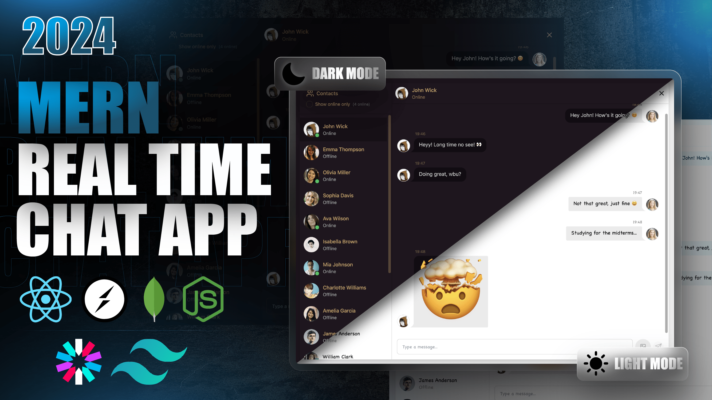

# Full Stack Realtime Chat App

A modern, real-time chat application built with the MERN stack, featuring secure authentication, instant messaging, and online user status tracking.

## Features

- **Authentication & Authorization**: Secure user registration and login with JWT tokens
- **Real-time Messaging**: Instant text and image messaging using Socket.io
- **Online User Status**: See which users are currently online
- **Profile Management**: Update user profiles with avatars uploaded to Cloudinary
- **Theme Support**: Light and dark mode themes with DaisyUI
- **Error Handling**: Comprehensive error handling on both client and server sides
- **Responsive Design**: Mobile-friendly UI built with TailwindCSS

## Tech Stack

### Backend
- Node.js
- Express.js
- MongoDB with Mongoose
- Socket.io for real-time communication
- JWT for authentication
- Cloudinary for image uploads
- bcryptjs for password hashing

### Frontend
- React 18
- Vite for build tooling
- Zustand for global state management
- TailwindCSS for styling
- DaisyUI for UI components
- Axios for API calls
- Socket.io-client for real-time features
- React Router for navigation

## Prerequisites

- Node.js (v14 or higher)
- npm or yarn
- MongoDB (local or cloud instance like MongoDB Atlas)

## Installation

1. Clone the repository:
   ```bash
   git clone https://github.com/Supriya1110/Fullstack-chat-app
   cd fullstack-chat-app
   ```

2. Install backend dependencies:
   ```bash
   cd backend
   npm install
   ```

3. Install frontend dependencies:
   ```bash
   cd ../frontend
   npm install
   ```

## Environment Setup

Create a `.env` file in the `backend` directory with the following variables:

```env
MONGODB_URI=your_mongodb_connection_string
PORT=5001
JWT_SECRET=your_jwt_secret_key

CLOUDINARY_CLOUD_NAME=your_cloudinary_cloud_name
CLOUDINARY_API_KEY=your_cloudinary_api_key
CLOUDINARY_API_SECRET=your_cloudinary_api_secret

NODE_ENV=development
```

## Usage

### Development

1. Start the backend server:
   ```bash
   cd backend
   npm run dev
   ```

2. Start the frontend development server:
   ```bash
   cd frontend
   npm run dev
   ```

3. Open your browser and navigate to `http://localhost:5173`

### Production

1. Build the frontend:
   ```bash
   npm run build
   ```

2. Start the application:
   ```bash
   npm start
   ```

## API Endpoints

### Authentication
- `POST /api/auth/signup` - User registration
- `POST /api/auth/login` - User login
- `POST /api/auth/logout` - User logout
- `GET /api/auth/check` - Check authentication status
- `PUT /api/auth/update-profile` - Update user profile

### Messages
- `GET /api/messages/:id` - Get messages with a specific user
- `POST /api/messages/send/:id` - Send a message to a specific user

## Screenshots



## Contributing

1. Fork the repository
2. Create a feature branch (`git checkout -b feature/AmazingFeature`)
3. Commit your changes (`git commit -m 'Add some AmazingFeature'`)
4. Push to the branch (`git push origin feature/AmazingFeature`)
5. Open a Pull Request

## License

This project is licensed under the ISC License.
